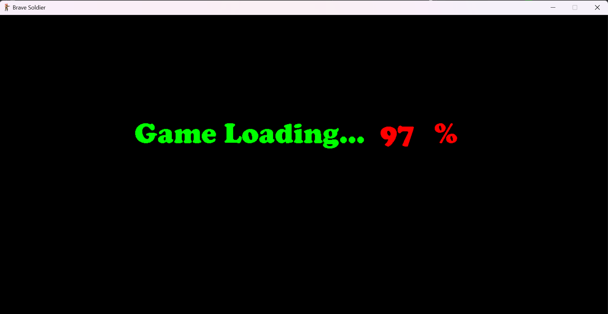
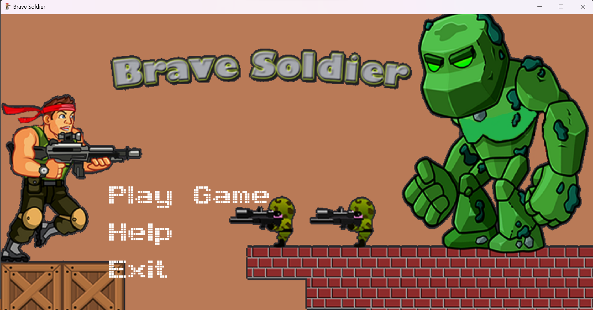
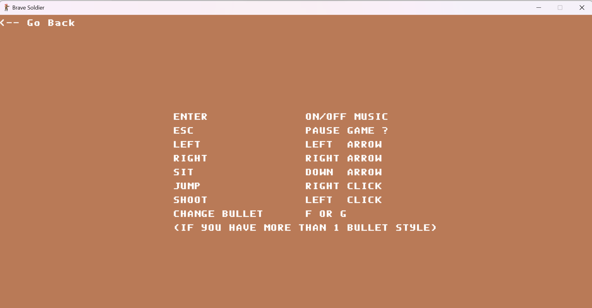
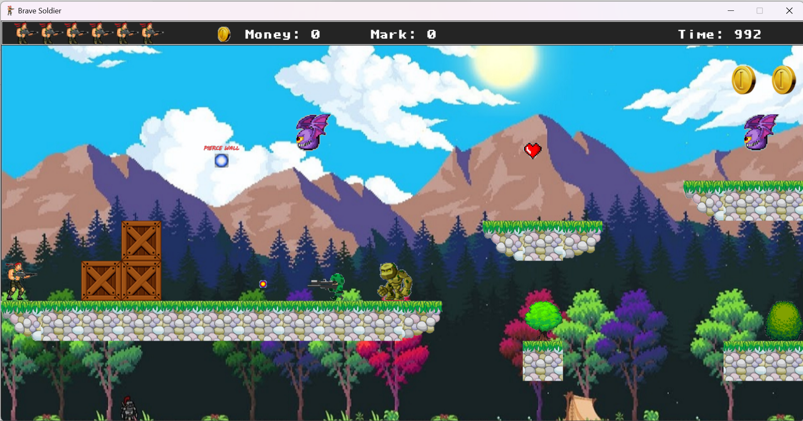
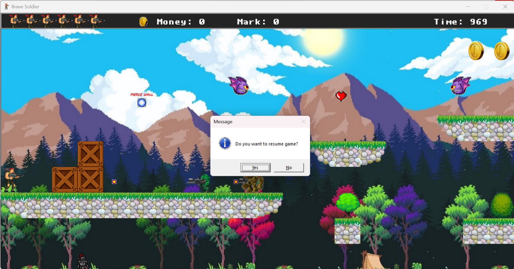
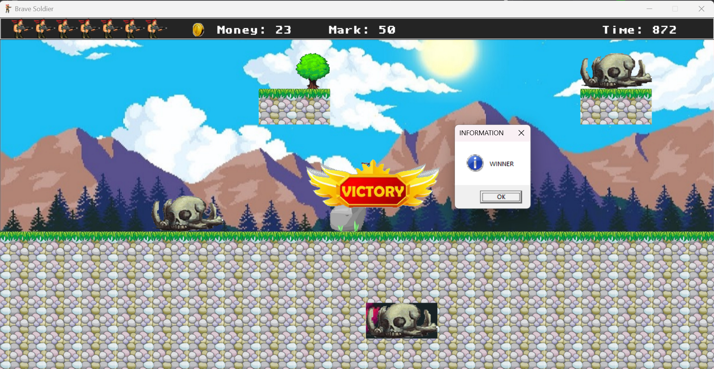
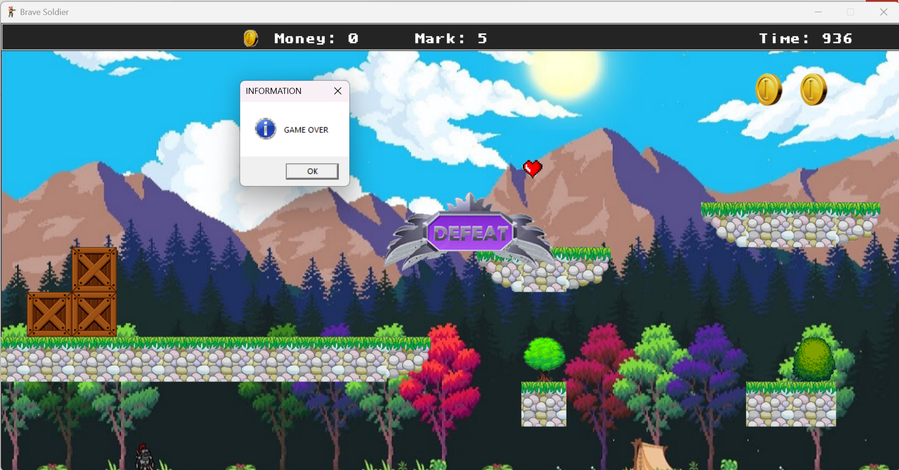

# Brave-Soldier
 Game bắn súng 2D
**1. Mô tả**
- Xây dựng ứng dụng game bắn súng 2D với các tính năng:
    + Menu thao tác game: Play game, help, exit
    + Sử dụng đồ họa 2D, xây dựng map trên file .dat
    + Di chuyển vượt chướng ngại vật, ăn tiền, tiêu diệt quái
- Mục tiêu: 
    + Phát triển kỹ năng thiết kế giao diện 2D
    + Xây dựng game 2D cơ bản
- Công nghệ sử dụng:
    + C++, thư viện đồ họa sdl2
    + Visual studio IDE 2019

**2. Cài đặt** 
- Chạy file **.exe** hoặc **.msi** trong folder **/setup/Debug**

**3. Giao diện chính**
<h4 align="center">Loading</h4>

---

<h4 align="center">Menu</h4>

---

<h4 align="center">Help</h4>

---

<h4 align="center">Bắt đầu game</h4>

---

<h4 align="center">Tạm dừng game</h4>

---

<h4 align="center">Thắng cuộc</h4>

---

<h4 align="center">Thua cuộc</h4>

---

<h4 align="center">...</h4>